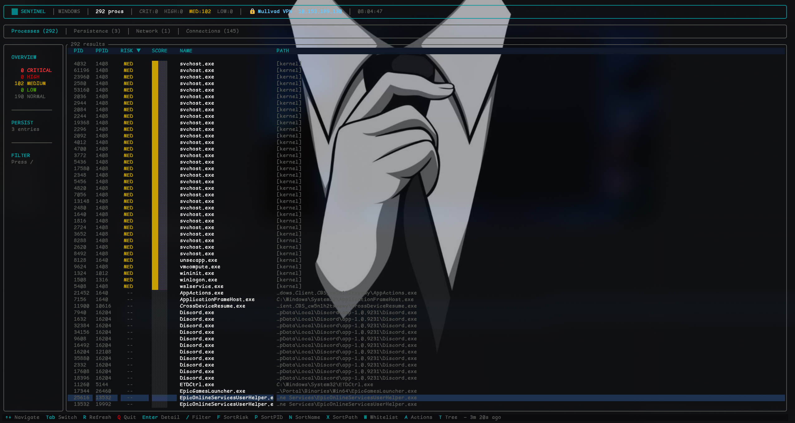

# ARQENOR

[](https://github.com/Arqenor/arqenor/actions/workflows/ci.yml)
[](LICENSE)

**Open-source EDR (Endpoint Detection & Response)** — cross-platform, built in Rust and Go.

ARQENOR gives independent developers, small teams, and security researchers commercial-grade detection capabilities without the $30/endpoint/month price tag. Real-time monitoring of processes, filesystem, network connections, persistence mechanisms, and memory — with SIGMA rules, IOC threat intelligence, YARA scanning, and alert correlation built in.

```
┌──────────────────────────────────────────────────────────┐
│                      ARQENOR Stack                      │
│                                                          │
│  ┌──────────────┐  ┌─────────────┐  ┌────────────────┐  │
│  │ arqenor-tui │  │ arqenor-cli│  │  External API  │  │
│  │   (Ratatui)  │  │   (clap)    │  │    Clients     │  │
│  └──────┬───────┘  └──────┬──────┘  └───────┬────────┘  │
│         │                 │                  │           │
│         └─────────────────┼──────────────────┘           │
│                           ▼                              │
│               ┌───────────────────────┐                  │
│               │    Go Orchestrator    │                  │
│               │  REST API :8080 (Gin) │                  │
│               └──────────┬────────────┘                  │
│                          │ gRPC                          │
│                          ▼                               │
│               ┌───────────────────────┐                  │
│               │   arqenor-grpc       │                  │
│               │   Tonic :50051        │                  │
│               └──────────┬────────────┘                  │
│                          │                               │
│         ┌────────────────┼────────────────┐              │
│         ▼                ▼                ▼              │
│  ┌─────────────┐  ┌──────────────┐  ┌──────────────┐    │
│  │arqenor-    │  │arqenor-     │  │arqenor-     │    │
│  │platform     │  │store         │  │core          │    │
│  │(Win/Lin/Mac)│  │(SQLite)      │  │(traits+models│    │
│  └─────────────┘  └──────────────┘  └──────────────┘    │
└──────────────────────────────────────────────────────────┘
```

---

## Screenshots

### Terminal UI (Ratatui)


---

## Features

| Category | Capability |
|---|---|
| **Detection Engine** | 32 LOLBin rules, 3000+ SIGMA community rules, file-path rules, PE static analysis |
| **Threat Intelligence** | IOC database (abuse.ch feeds: MalwareBazaar, Feodo, URLhaus, ThreatFox), auto-refresh 4h |
| **Alert Correlation** | PID + parent-child grouping, ATT&CK-weighted scoring, incident model |
| **Memory Forensics** | VAD walk (shellcode detection), process hollowing, NTDLL hook detection |
| **YARA Scanning** | In-memory scanning (yara-x, pure Rust): Cobalt Strike, Mimikatz, Sliver, Meterpreter, shellcode |
| **BYOVD Detection** | 50 known-vulnerable kernel drivers (LOLDrivers.io blocklist) |
| **Network Analysis** | C2 beaconing (CV scoring), DNS tunneling, DGA detection, JA4 TLS fingerprinting |
| **Processes** | Snapshot + streaming monitor, SHA-256 hashing, risk scoring, real-time connection monitoring |
| **Persistence** | Win: Registry, Tasks, Services, WMI, COM, BITS, AppInit, IFEO (B1-B9) · Lin: Cron, Systemd, LD_PRELOAD, PAM, SSH, git hooks (C1-C7) · Mac: LaunchDaemon/Agent, login items, auth plugins |
| **Filesystem** | FIM baseline + real-time watch (ReadDirectoryChangesW / inotify / ESF) |
| **Kernel Telemetry** | ETW (10 providers, TDH parsing) · eBPF (5 probes) · ESF (macOS) |
| **TUI** | Live Ratatui dashboard with alert streaming |
| **CLI** | `arqenor scan` · `arqenor watch --sigma-dir --yara-dir --no-ioc` |
| **API** | REST (Go/Gin) + gRPC (Rust/Tonic) + SSE alert streaming |
| **Cross-platform** | Windows 10+, Linux, macOS — single codebase via `cfg-if` |
| **ATT&CK Coverage** | ~140+ techniques across TA0001-TA0011 |

---

## Quick Start

### Prerequisites

| Tool | Version | Purpose |
|---|---|---|
| Rust toolchain | 1.80+ | Build Rust crates |
| Go | 1.23+ | Build orchestrator |
| protoc | 3.x | Regenerate gRPC stubs |
| protoc-gen-go / protoc-gen-go-grpc | latest | Go proto codegen |

### Build

```bash
# 1. Clone
git clone https://github.com/Arqenor/arqenor.git
cd arqenor

# 2. Build all Rust binaries
cargo build --release \
  -p arqenor-cli \
  -p arqenor-tui \
  -p arqenor-grpc

# 3. Build Go orchestrator
cd go && go build ./cmd/orchestrator && cd ..

# 4. (Optional) Regenerate proto stubs
./scripts/gen-proto.ps1   # Windows PowerShell
```

### Run

```bash
# Terminal 1 — gRPC host analyzer
./rust/target/release/arqenor-grpc

# Terminal 2 — REST orchestrator
./go/orchestrator

# Terminal 3 — choose your interface
./rust/target/release/arqenor scan          # one-shot CLI
./rust/target/release/arqenor watch         # continuous CLI
./rust/target/release/arqenor-tui           # dashboard UI
```

---

## Project Structure

```
arqenor/
├── rust/
│   ├── arqenor-core/       # Domain nucleus: traits, models, pipeline, rules, IOC, correlation
│   ├── arqenor-platform/   # Win/Lin/Mac: ETW, ESF, connections, memory scan, YARA, BYOVD
│   ├── arqenor-grpc/       # Tonic gRPC server (port 50051)
│   ├── arqenor-store/      # SQLite persistence layer
│   ├── arqenor-tui/        # Ratatui terminal dashboard
│   └── arqenor-cli/        # clap CLI (scan / watch)
├── arqenor-ebpf/           # Linux eBPF kernel probes (libbpf-rs, 5 probes)
├── go/
│   ├── cmd/orchestrator/   # Entry point
│   ├── internal/api/       # Gin REST handlers + SSE alert streaming
│   ├── internal/grpc/      # gRPC client + generated stubs
│   └── internal/store/     # Go-side SQLite store
├── proto/                   # Protobuf definitions
├── configs/                 # Runtime configuration (arqenor.toml)
└── docs/                    # Architecture, roadmap, guides
```

---

## Configuration

Copy `configs/arqenor.toml` to your working directory and adjust paths:

```toml
[general]
log_level = "info"       # trace | debug | info | warn | error
data_dir  = "./data"

[grpc]
host_analyzer_addr   = "127.0.0.1:50051"
network_scanner_addr = "127.0.0.1:50052"

[api]
listen_addr = "127.0.0.1:8080"

[scan]
fs_roots      = ["C:\\Users", "C:\\Windows\\System32"]
max_file_size = 10485760   # bytes (10 MB)
interval_secs = 60

[alerts]
min_severity = "medium"    # info | low | medium | high | critical
```

Full reference → [`docs/guides/configuration.md`](docs/guides/configuration.md)

---

## Documentation

| Document | Description |
|---|---|
| [Architecture Overview](docs/architecture/overview.md) | Component diagram, data flow, design decisions |
| [Rust Crates](docs/architecture/crates.md) | Detailed breakdown of each crate |
| [gRPC Services](docs/architecture/grpc-services.md) | Proto definitions, RPC methods, message types |
| [Go Orchestrator](docs/architecture/go-orchestrator.md) | REST API, gRPC client, orchestration logic |
| [Installation Guide](docs/guides/installation.md) | Prerequisites, build steps, cross-compilation |
| [Configuration Reference](docs/guides/configuration.md) | Every `arqenor.toml` key explained |
| [Usage Guide](docs/guides/usage.md) | CLI commands, TUI controls, API calls |
| [Build System](docs/development/build.md) | Cargo workspace, proto codegen, CI targets |
| [Platform Notes](docs/development/platform-notes.md) | Windows/Linux/macOS specific details |
| [Contributing](docs/development/contributing.md) | Code style, PR flow, adding new platforms |
| [REST API Reference](docs/reference/api.md) | Endpoint spec with request/response examples |
| [CLI Reference](docs/reference/cli.md) | All flags and subcommands |
| [Proto Reference](docs/reference/proto.md) | Full proto3 message and service definitions |

---

## Roadmap

See [`docs/roadmap/ROADMAP.md`](docs/roadmap/ROADMAP.md) for the full 6-phase plan.

| Phase | Focus | Status |
|-------|-------|--------|
| **Phase 1** | Detection Engine + LOTL Rules (32 LOLBin rules, persistence B1-B9/C1-C7, FIM, credential theft) | ✅ Done |
| **Phase 2** | Kernel Telemetry: ETW (10 providers), eBPF (5 probes), ESF (macOS), WDK driver | ✅ Done |
| **Phase 3** | Network: C2 beaconing, DNS tunneling, DGA, JA4 TLS fingerprinting, connection monitoring | ✅ Done |
| **Phase 4** | SIGMA engine (3000+ rules), IOC feeds (abuse.ch), correlation engine, PE static analyzer | ✅ Done (behavioral ML pending) |
| **Phase 5** | Memory forensics (VAD, hollowing, NTDLL hooks), BYOVD (50 drivers), YARA scanning | ✅ Done |
| **Phase 6** | Cloud dashboard, fleet management, automated response | Not started |

---

## Business Model

ARQENOR is **open-core**:

- **Open source** (Apache 2.0, this repo) — `arqenor-core`, `arqenor-platform`, `arqenor-cli`, `arqenor-tui`, `arqenor-grpc`, `arqenor-store`, `arqenor-ebpf`, Go orchestrator
- **Closed / commercial** (`arqenor-enterprise`) — Windows kernel driver (WDK), ML scorer (PE static analyzer), Tauri desktop app, cloud dashboard, premium threat intelligence feeds, multi-host management, enterprise alerting

---

## Contributing

See [`CONTRIBUTING.md`](CONTRIBUTING.md) for build instructions, commit conventions, and the PR process.
Security issues: see [`SECURITY.md`](SECURITY.md) — please do **not** open a public issue.

---

## License

Licensed under the [Apache License, Version 2.0](LICENSE). See [`NOTICE`](NOTICE) for attribution.
